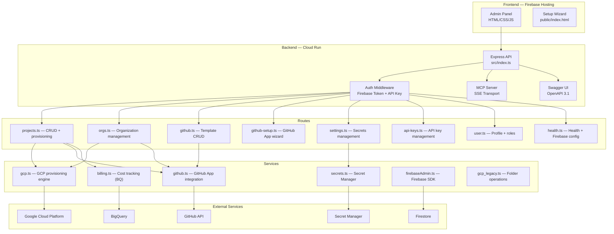
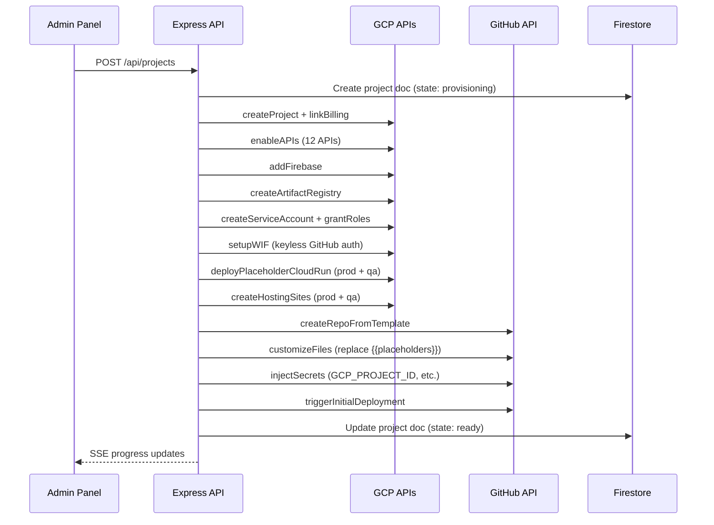

# Architecture — WIZBI Control Plane

> **What is this?** A self-service PaaS that provisions complete GCP + GitHub infrastructure with one click.

---

## System Diagram



---

## Module Map

### `src/routes/` — API Endpoints

| File | Prefix | Purpose |
|------|--------|---------|
| `health.ts` | `/api/healthz`, `/api/firebase-config` | Health check, Firebase config for frontend |
| `user.ts` | `/api/user/*` | User profile, role management |
| `projects.ts` | `/api/projects/*` | CRUD, provisioning, billing, retry, delete |
| `orgs.ts` | `/api/orgs/*` | Organization CRUD (creates GCP folder + GitHub team) |
| `github.ts` | `/api/github/*` | Template listing, creation, deletion |
| `github-setup.ts` | `/api/github-setup/*` | GitHub App creation wizard + webhook |
| `settings.ts` | `/api/settings/*` | Secret Manager CRUD via Admin Panel |
| `api-keys.ts` | `/api/api-keys/*` | Programmatic API key management |

### `src/services/` — Business Logic

| File | Purpose |
|------|---------|
| `gcp.ts` | Full GCP provisioning: project, APIs, Firebase, Cloud Run, AR, IAM, WIF |
| `gcp_legacy.ts` | GCP Folder creation/deletion (Organization-level operations) |
| `github.ts` | GitHub App auth, repo from template, file customization, secrets injection, CI/CD trigger |
| `billing.ts` | Two-tier: Cloud Billing API (account info) + BigQuery (cost data) |
| `secrets.ts` | Secret Manager read/write wrapper |
| `firebaseAdmin.ts` | Firebase Admin SDK singleton |

### `src/mcp/` — Model Context Protocol Server

| File | Purpose |
|------|---------|
| `index.ts` | SSE transport, session management, `/api/mcp/sse` endpoint |
| `tools.ts` | 15+ tools mapping 1:1 to REST API operations |
| `resources.ts` | Read-only resource endpoints for AI context |

### `src/middleware/`

| File | Purpose |
|------|---------|
| `auth.ts` | Unified auth: Firebase ID Token + API Key, role checks |

---

## Provisioning Pipeline

When a user clicks **"Create Project"** in the Admin Panel:



**Provisioned resources per project:**
- GCP Project (under org folder, billing linked)
- 12 GCP APIs enabled
- Firebase + Firestore + Hosting (prod + QA)
- Cloud Run services (prod + QA) with placeholder image
- Artifact Registry Docker repo
- Service Account with least-privilege IAM roles
- Workload Identity Federation (keyless GitHub → GCP auth)
- GitHub repo (from template, files customized, secrets injected)
- CI/CD pipeline triggered automatically

---

## Authentication

Two authentication strategies, unified in `src/middleware/auth.ts`:

| Method | Header | Use Case |
|--------|--------|----------|
| Firebase ID Token | `Authorization: Bearer <token>` | Browser-based Admin Panel |
| API Key | `X-API-Key: <key>` | Programmatic access, MCP clients |

API keys are SHA-256 hashed and stored in Firestore. Both strategies resolve to a user profile with roles (`superAdmin`, `orgAdmin`).

---

## Data Model (Firestore)

| Collection | Key Fields | Purpose |
|------------|-----------|---------|
| `orgs` | `name`, `gcpFolderId`, `githubTeamSlug` | Organizations |
| `projects` | `displayName`, `orgId`, `state`, `template` | Projects + provisioning state |
| `userProfiles` | `email`, `roles.superAdmin`, `roles.orgAdmin[]` | User roles |
| `apiKeys` | `hashedKey`, `userId`, `name` | API key registry |
| `logs` (subcollection under projects) | `event`, `data`, `timestamp` | Provisioning audit trail |
| `globalLinks` / project `links` | `name`, `url`, `icon` | Custom dashboard links |

---

## Environment Variables

### Required (set by bootstrap)

| Variable | Description |
|----------|-------------|
| `GCP_PROJECT_ID` | Control plane project ID |
| `FIREBASE_PROJECT_ID` | Same as GCP_PROJECT_ID |
| `BILLING_ACCOUNT_ID` | GCP billing account ID |
| `ADMINS` | Comma-separated admin emails |
| `GCP_CONTROL_PLANE_PROJECT_NUMBER` | Project number (for IAM) |
| `GITHUB_OWNER` | GitHub org or user |
| `CORS_ORIGIN` | Allowed origins (auto-derived if not set) |

### Optional

| Variable | Description |
|----------|-------------|
| `FIREBASE_API_KEY` | Firebase Web API key (for direct Cloud Run access) |
| `GCP_DEFAULT_REGION` | Default region (default: `europe-west1`) |
| `BILLING_BQ_PROJECT` | BigQuery project for cost data |
| `BILLING_BQ_DATASET` | BigQuery dataset name |
| `BILLING_BQ_TABLE` | BigQuery export table name |

---

## CI/CD Pipeline

```
Push to `dev`  → build → deploy Cloud Run (cp-unified-qa) → deploy Hosting (QA)
Push to `main` → build → deploy Cloud Run (cp-unified)    → deploy Hosting (prod)
```

Authentication is **keyless** via Workload Identity Federation — no service account keys stored in GitHub.

---

## Key Integrations

| Integration | API | Purpose |
|-------------|-----|---------|
| GCP Resource Manager | `cloudresourcemanager.googleapis.com` | Project/Folder CRUD |
| GCP Cloud Billing | `cloudbilling.googleapis.com` | Link billing, cost data |
| GCP Cloud Run | `run.googleapis.com` | Deploy services |
| GCP Artifact Registry | `artifactregistry.googleapis.com` | Docker image storage |
| GCP IAM | `iam.googleapis.com` | Service accounts, WIF |
| GCP Secret Manager | `secretmanager.googleapis.com` | Secure credential storage |
| GCP BigQuery | `bigquery.googleapis.com` | Billing cost queries |
| Firebase | `firebase.googleapis.com` | Auth, Firestore, Hosting |
| GitHub REST API | `api.github.com` | Repos, teams, secrets, workflows |
